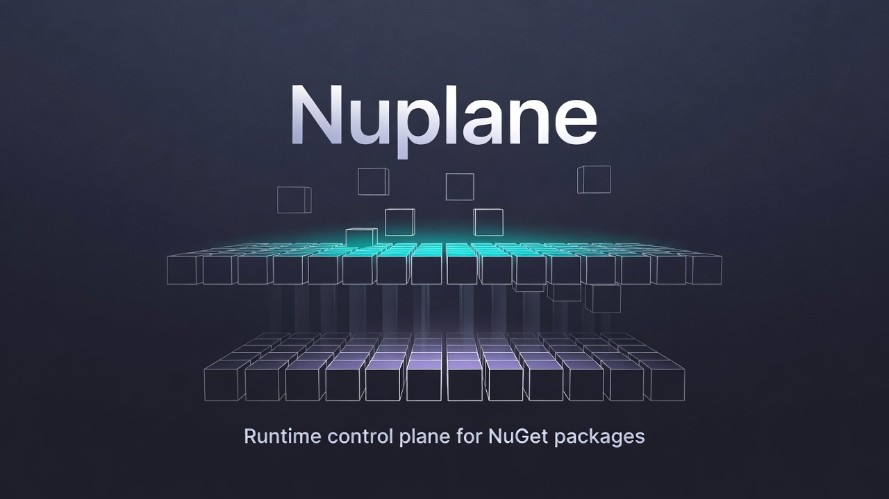

# Nuplane

Nuplane is a lightweight runtime control plane for NuGet packages.

It enables .NET applications to resolve, synchronize, and manage NuGet packages at runtime with deterministic storage, transactional updates, and host-neutral change events.

Nuplane does **not** define a plugin model.  
It provides infrastructure for package reconciliation — nothing more, nothing less.

---

## ✨ What Nuplane Does

- Resolve packages from NuGet v3 feeds
- Support `.nupkg` drop-folder deployment
- Maintain a deterministic on-disk package store
- Reconcile desired vs actual package state
- Apply atomic per-package updates
- Provide last-known-good (LKG) fallback
- Emit structured change events for host integration
- Offer integrity validation hooks
- Provide operational visibility (logs, metrics, health)

---

## 🚫 What Nuplane Does Not Do

- It does not define a plugin entrypoint model.
- It does not mutate your DI container.
- It does not impose activation semantics.
- It does not guarantee in-process assembly unload.
- It does not sandbox untrusted code.

Nuplane is infrastructure. Your host decides what to do when packages change.

---

## 🧠 Core Concept

Nuplane implements a simple control loop:

1. Determine **desired packages**
2. Compare with **current state**
3. Compute a diff
4. Apply transactional updates
5. Emit change events

Hosts (e.g., web apps, workers, modular systems) react to change events by reloading, rescanning, or reconfiguring as needed.

---

## 📦 Example

```csharp
builder.Services.AddNuplane(options =>
{
    options.RootDirectory = "packages";
    options.PollInterval = TimeSpan.FromMinutes(1);

    options.Feeds.Add(new FeedDefinition(
        Name: "Main",
        ServiceIndex: new Uri("https://api.nuget.org/v3/index.json"),
        TrustLevel: FeedTrustLevel.Trusted
    ));

    options.Packages.Add(new PackageRequest(
        Id: "My.Plugin",
        VersionRange: "[1.0.0,2.0.0)"
    ));

    options.Desired.FromNupkgDirectory("drop-folder");
});
````

When packages are added, updated, or removed, Nuplane emits a `PackageChangeSet` event.

---

## 🗂 Package Store Layout

Nuplane maintains a deterministic store:

```
root/
  state.json
  packages/{id}/{version}/
  current/{id} -> ../packages/{id}/{version}
  staging/
```

Updates are atomic:

* Download to staging
* Validate
* Move to immutable store
* Atomically switch active version
* Persist state

If anything fails, the previous version remains active.

---

## 🔄 Reconciliation Model

Nuplane runs a polling loop (configurable interval):

* Aggregate desired state (explicit + discovery sources)
* Resolve versions from feeds
* Compute diff (add / update / remove)
* Apply per-package transactions
* Emit change events

The process is idempotent and safe to retry.

---

## 🔍 Desired State Sources

Nuplane supports multiple ways to declare desired packages:

### Explicit

```csharp
options.Packages.Add(new PackageRequest("My.Plugin", "[1.0.0,2.0.0)"));
```

### Directory-Based (.nupkg Drop Folder)

```csharp
options.Desired.FromNupkgDirectory("drop-folder");
```

Dropping a `.nupkg` into the folder adds it.
Removing the file removes it.

---

## 🛡 Integrity & Trust

Nuplane supports validation hooks:

```csharp
public interface IPackageValidator
{
    Task ValidateAsync(PackageArtifact artifact);
}
```

Possible implementations:

* Hash validation
* Signature validation
* Allowlist / denylist
* Feed trust enforcement

Nuplane assumes trusted code execution unless your host enforces additional policies.

---

## 📊 Observability

Nuplane provides:

* Structured lifecycle logs
* Per-cycle correlation IDs
* Metrics (adds, updates, failures, durations)
* Health state (healthy / degraded)
* Persistent state tracking

---

## 🧱 Architecture

Nuplane is modular:

* `Nuplane.Runtime` — control plane + reconciliation loop
* `Nuplane.Store` — deterministic package store
* `Nuplane.NuGet` — NuGet protocol integration
* `Nuplane.Sources.Directory` — folder-based desired source
* `Nuplane.Hosting` — DI/Generic Host integration
* `Nuplane.Loading` (optional) — assembly loading support

---

## 🎯 Design Principles

* Deterministic
* Transactional
* Host-neutral
* Operationally safe
* Minimal abstraction surface
* No accidental framework creep

---

## 🚀 Roadmap

See `docs/roadmap.md` for detailed phase breakdown.

---

## License

[MIT](LICENSE.md)

---

Nuplane is infrastructure for runtime package reconciliation — clean, predictable, and composable.
