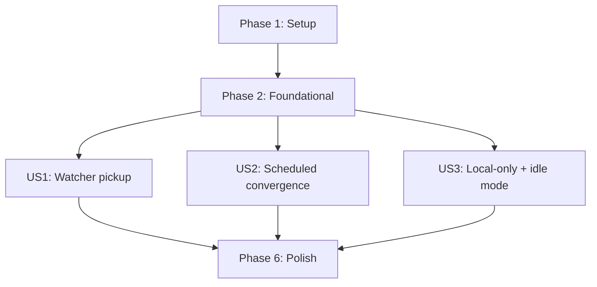

---

description: "Task list for implementing local directory feeds + watchers"
---

# Tasks: Local Directory Feeds + Watchers (No Separate "Drop Folder")

**Input**: Design documents from `/specs/008-local-feeds-and-watchers/`
**Prerequisites**: plan.md (required), spec.md (required for user stories), research.md, data-model.md, contracts/, quickstart.md

**Tests**: Test tasks are REQUIRED for changed behavior and boundaries. Include unit tests plus contract and/or integration tests as applicable.

**Organization**: Tasks are grouped by user story to enable independent implementation and testing of each story.

## Format: `[ID] [P?] [Story] Description`

- **[P]**: Can run in parallel (different files, no dependencies)
- **[Story]**: Which user story this task belongs to (e.g., US1, US2, US3)
- Every task description MUST include at least one concrete file path

---

## Phase 1: Setup (Shared Infrastructure)

**Purpose**: Small shared scaffolding to make later tests deterministic and easy to author.

- [x] T001 [P] Add temp directory helper for tests in test/Nuplane.Runtime.Tests/TestSupport/TempDirectory.cs
- [x] T002 [P] Add debounce/timing assertion helper for tests in test/Nuplane.Runtime.Tests/TestSupport/DebounceAssert.cs
- [x] T003 [P] Add minimal test `.nupkg` builder helper (zip writer) in test/Nuplane.Runtime.Tests/TestSupport/NupkgTestBuilder.cs

---

## Phase 2: Foundational (Blocking Prerequisites)

**Purpose**: Core infrastructure that MUST be complete before ANY user story can be implemented.

**⚠️ CRITICAL**: No user story work can begin until this phase is complete.

### Feed + options foundations

- [x] T004 Add FeedName to directory source options in src/Nuplane/Extensions/DirectorySourceOptions.cs
- [x] T005 Validate FeedName + directory path + debounce invariants in src/Nuplane/Extensions/NuplaneOptionsValidators.cs
- [x] T006 Default directory SourceName to FeedName (and normalize directory path) in src/Nuplane/Extensions/NuplaneDirectorySourceServiceCollectionExtensions.cs
- [x] T007 Register local directory feeds into feed resolution (as `FeedDefinition` with `file://`) and pass FeedName into the desired source registration in src/Nuplane/Extensions/NuplaneDirectorySourceServiceCollectionExtensions.cs

- [x] T008 Allow `file://` feeds and forbid credentials for `file://` feeds in src/Nuplane.Runtime/Configuration/FeedCredentialOptionsValidator.cs
- [x] T009 [P] Add unit tests for `file://` feed validation in test/Nuplane.Runtime.Tests/Configuration/FeedCredentialOptionsValidatorTests.cs

### Trigger attribution foundations

- [x] T010 Add reconciliation trigger model (TriggerType + optional TriggerSource) in src/Nuplane.Runtime/Reconciliation/Models/ReconciliationTrigger.cs
- [x] T011 Extend reconciliation service API to accept trigger metadata in src/Nuplane.Runtime/Reconciliation/IReconciliationService.cs
- [x] T012 Propagate trigger metadata through reconciliation execution and single-flight skips in src/Nuplane.Runtime/Reconciliation/ReconciliationService.cs
- [x] T013 Store trigger metadata on cycle context in src/Nuplane.Runtime/Reconciliation/Middleware/ReconciliationCycleContext.cs

- [x] T014 Emit Scheduled triggers from the periodic host in src/Nuplane/ReconciliationHostedService.cs (TriggerSource SHOULD be omitted)
- [x] T015 Emit DirectoryChange triggers from the directory watcher host in src/Nuplane/Extensions/NuplaneDirectorySourceServiceCollectionExtensions.cs (TriggerSource MUST be local directory FeedName)
- [x] T016 Emit Manual triggers (preserving provided correlation id) in src/Nuplane.Runtime/Reconciliation/ManualReconcileCoordinator.cs

### Baseline observability + safety foundations

- [x] T017 Add trigger counters + idle-mode gauge to telemetry in src/Nuplane.Runtime/Observability/ReconciliationTelemetry.cs
- [x] T018 Add trigger/idle recording helpers to metrics in src/Nuplane.Runtime/Observability/ReconciliationMetrics.cs
- [x] T019 Add trigger + idle structured logging in src/Nuplane.Runtime/Observability/IReconciliationLogger.cs and src/Nuplane.Runtime/Observability/ReconciliationLogger.cs

- [x] T020 Emit explicit idle-mode diagnostic when no feeds are configured in src/Nuplane.Runtime/Reconciliation/Middleware/HealthAndMetricsMiddleware.cs
- [x] T021 [P] Extend rollback/LKG coverage for transaction stage failures in test/Nuplane.Store.Tests/Transactions/PackageTransactionCoordinatorTests.cs

**Checkpoint**: Foundation ready — user story implementation can now begin.

---

## Phase 3: User Story 1 — Watcher-driven near-real-time pickup (Priority: P1) 🎯 MVP

**Goal**: Dropping a `.nupkg` into a configured local directory feed triggers reconciliation quickly and deterministically, with coalesced events and partial-write safety.

**Independent Test**: Start a host with a configured local directory feed and watcher enabled; create/copy a `.nupkg` and observe a directory-triggered reconciliation cycle within the debounce window + a small bound (target ≤2s for most events). Verify no reconcile storm under bursty events.

### Tests for User Story 1 ⚠️

> Write these tests FIRST, ensure they FAIL before implementation.

- [x] T022 [P] [US1] Add contract test: coalescing/debounce invariants for directory observation in test/Nuplane.Runtime.Tests/Extensions/DirectoryObservationContractTests.cs
- [x] T023 [P] [US1] Add unit tests: bounded partial-write stability probe behavior in test/Nuplane.Runtime.Tests/Sources/Directory/NupkgFileStabilityProbeTests.cs

### Implementation for User Story 1

- [x] T024 [P] [US1] Implement bounded `.nupkg` stability probe helper in src/Nuplane.Sources.Directory/NupkgFileStabilityProbe.cs
- [x] T025 [US1] Apply stability probe during directory desired-state enumeration to avoid unstable `.nupkg` inputs in src/Nuplane.Sources.Directory/DirectoryNupkgDesiredSource.cs
- [x] T026 [US1] Emit PackageRequest with explicit FeedName (and SourceName attribution) for directory-discovered packages in src/Nuplane.Sources.Directory/DirectoryNupkgDesiredSource.cs
- [x] T027 [US1] Log watcher enabled status with trigger attribution, including FeedName and effective debounce window, in src/Nuplane/Extensions/NuplaneDirectorySourceServiceCollectionExtensions.cs

**Checkpoint**: User Story 1 works independently (watcher triggers + deterministic behavior).

---

## Phase 4: User Story 2 — Scheduled polling/convergence fallback (Priority: P2)

**Goal**: Scheduled reconciliation continues to converge across all configured feeds, and remains effective even when watcher establishment is degraded/unavailable.

**Independent Test**: Configure feeds and verify periodic reconciliation continues across intervals; simulate a watcher failure and confirm scheduled triggers still run and convergence happens within one poll interval.

### Tests for User Story 2 ⚠️

- [x] T028 [P] [US2] Add contract test: trigger attribution propagation (including single-flight skip behavior) in test/Nuplane.Runtime.Tests/Reconciliation/ReconciliationTriggerAttributionContractTests.cs
- [x] T029 [P] [US2] Add integration test: Scheduled trigger attribution is observable end-to-end in test/Nuplane.Integration.Tests/Reconciliation/ScheduledTriggerAttributionIntegrationTests.cs
- [x] T030 [P] [US2] Add integration test: watcher degraded falls back to scheduled reconciliation and surfaces `source-outages:N` degraded reason in test/Nuplane.Integration.Tests/Reconciliation/DirectoryWatcherDegradedFallbackIntegrationTests.cs

### Implementation for User Story 2

- [x] T031 [US2] Make watcher establishment failures non-fatal and emit degraded-state logs with FeedName + last error in src/Nuplane/Extensions/NuplaneDirectorySourceServiceCollectionExtensions.cs
- [x] T032 [US2] Surface watcher establishment degradation via `SourceOutages` so it appears as `source-outages:N` in OperationalSnapshot.DegradedReasons in src/Nuplane.Runtime/Reconciliation/Middleware/HealthAndMetricsMiddleware.cs
- [x] T033 [US2] Record attempted Scheduled triggers even when single-flight skips cycles in src/Nuplane/ReconciliationHostedService.cs

**Checkpoint**: User Stories 1 and 2 both work independently (watcher fast path + scheduled reliability).

---

## Phase 5: User Story 3 — Local-directory-only + idle mode (Priority: P3)

**Goal**: Nuplane can run with zero remote feeds configured (local directory feeds only) and reconcile dropped `.nupkg` artifacts without unhandled exceptions; when no feeds are configured at all, Nuplane enters explicit idle mode with a clear diagnostic/health signal.

**Independent Test**: Run with only a local directory feed configured and drop a `.nupkg`; verify resolution selects the local feed and the cycle completes safely. Then run with no feeds configured and verify idle-mode signal is emitted.

### Tests for User Story 3 ⚠️

- [x] T034 [P] [US3] Add contract test: local directory feeds are eligible candidates for resolution (no remote feeds required) in test/Nuplane.Runtime.Tests/Reconciliation/LocalDirectoryFeedContractTests.cs
- [x] T035 [P] [US3] Add regression integration test: local-directory-only avoids unhandled exception in test/Nuplane.Integration.Tests/Reconciliation/LocalDirectoryOnlyRegressionTests.cs
- [x] T036 [P] [US3] Add integration test: explicit idle mode when no feeds configured in test/Nuplane.Integration.Tests/Reconciliation/NoFeedsIdleModeIntegrationTests.cs
- [x] T037 [P] [US3] Add unit test: directory desired source sets FeedName + SourceName attribution correctly in test/Nuplane.Runtime.Tests/Sources/Directory/DirectoryNupkgDesiredSourceTests.cs

### Implementation for User Story 3

- [x] T038 [P] [US3] Add typed exception for no eligible feed (replaces InvalidOperationException path) in src/Nuplane.Runtime/Reconciliation/NoEligibleFeedException.cs
- [x] T039 [US3] Throw NoEligibleFeedException + record decision details when no candidates exist in src/Nuplane.Runtime/Reconciliation/MultiFeedPackageResolver.cs
- [x] T040 [US3] Map NoEligibleFeedException to an explicit failure stage/message in src/Nuplane.Runtime/Reconciliation/PackageApplyExecutor.cs

**Checkpoint**: All user stories work independently (including local-only and idle mode).

---

## Phase 6: Polish & Cross-Cutting Concerns

**Purpose**: Documentation and sample alignment; validate quickstart scenarios.

- [x] T041 [P] Update sample config to demonstrate local directory feeds (file:// + FeedName) in samples/Nuplane.Sample.AspNetCore/Program.cs and samples/Nuplane.Sample.AspNetCore/appsettings.json
- [x] T042 [P] Standardize terminology ("drop folder" → "local directory feed") in README.md
- [x] T043 Run and confirm quickstart validation steps in specs/008-local-feeds-and-watchers/quickstart.md

---

## Dependencies & Execution Order



### Story Completion Order

- **MVP**: US1 only (after Phase 1 + Phase 2)
- **Then**: US2 (scheduled convergence + degraded fallback)
- **Then**: US3 (local-only regression + idle mode)

### Parallel Opportunities

- **Phase 1**: T001–T003 are independent.
- **Phase 2**: T009 and T021 can run in parallel with other Phase 2 tasks.
- **US1**: T022–T024 can be done in parallel.
- **US2**: T028–T030 can be done in parallel.
- **US3**: T034–T038 can be done in parallel.

---

## Parallel Example: User Story 1

```bash
Task: "T022 Add contract test: coalescing/debounce invariants for directory observation in test/Nuplane.Runtime.Tests/Extensions/DirectoryObservationContractTests.cs"
Task: "T024 Implement bounded .nupkg stability probe helper in src/Nuplane.Sources.Directory/NupkgFileStabilityProbe.cs"
```

---

## Parallel Example: User Story 2

```bash
Task: "T029 Add integration test: Scheduled trigger attribution is observable end-to-end in test/Nuplane.Integration.Tests/Reconciliation/ScheduledTriggerAttributionIntegrationTests.cs"
Task: "T031 Make watcher establishment failures non-fatal and emit degraded-state logs with FeedName + last error in src/Nuplane/Extensions/NuplaneDirectorySourceServiceCollectionExtensions.cs"
```

---

## Parallel Example: User Story 3

```bash
Task: "T035 Add regression integration test: local-directory-only avoids unhandled exception in test/Nuplane.Integration.Tests/Reconciliation/LocalDirectoryOnlyRegressionTests.cs"
Task: "T038 Add typed exception for no eligible feed (replaces InvalidOperationException path) in src/Nuplane.Runtime/Reconciliation/NoEligibleFeedException.cs"
```

---

## Implementation Strategy

### MVP First (User Story 1 Only)

1. Complete Phase 1 + Phase 2 (blocking prerequisites)
2. Complete Phase 3 (US1) tests-first, then implementation
3. **STOP and VALIDATE**: US1 independently

### Incremental Delivery

- Add US1 → validate
- Add US2 → validate
- Add US3 → validate
- Finish polish tasks
